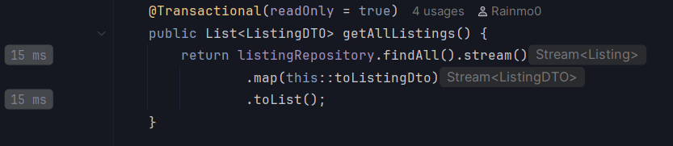

# Profiling

Profiling was conducted on the listing update method using the built-in profiler from IntelliJ IDEA. The purpose of the profiling process was to evaluate the runtime performance of the method and identify potential bottlenecks during execution.

The profiling result showed that the method executed in approximately 15 ms under the current local testing environment and dataset size. Based on the observed execution time and resource usage, no significant CPU or memory bottlenecks were identified.

Since the current workload is relatively small and the execution time is already low, major optimization is not currently necessary. However, possible future improvements may include database query optimization, indexing, or caching strategies if the system scales to larger datasets or higher request concurrency.